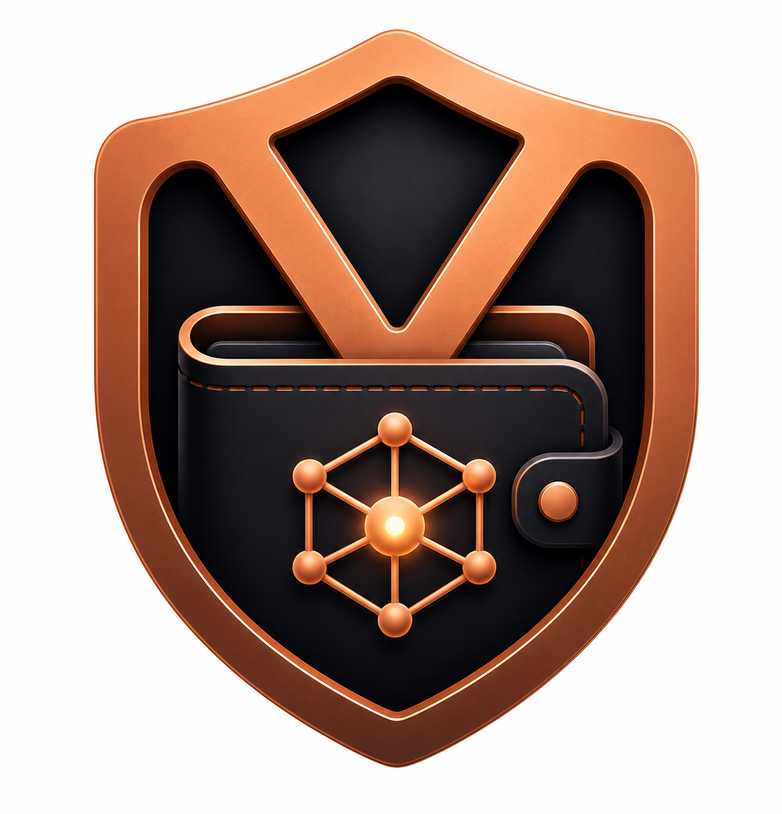

<p align="center">
  
</p>

<h1 align="center">Velo</h1>

<p align="center">
  <strong>Offline AI-powered personal finance controller.</strong>
</p>

<p align="center">
  
  
  
  
  
</p>

---

## 📖 Description

Velo is a privacy-first, on-device AI-powered personal finance controller. Built with Flutter, it operates entirely offline. All user transactions, account balances, and chat conversations remain strictly local on your device.

Velo integrates Google's **Gemma 4** model to perform intelligent receipt scanning, PDF bank statement parsing, natural language transaction description, and conversational financial analytics. For users who prefer a lightweight offline experience without downloading the 2.59GB model, Velo features a **Skip Setup** bypass to allow full access to manual logging, ledger accounts, and health stats.

Supported base currencies: **USD** ($), **EUR** (€), **GBP** (£), **TRY** (₺), **NGN** (₦), **CAD** (C$), **AUD** (A$).

---

## 🧠 On-Device AI Engine (Gemma 4)

Velo runs Google's **Gemma 4 E2B IT (LiteRT-LM)** model locally using the `flutter_gemma` package:
*   **Model Size**: `gemma-4-E2B-it.litertlm` (~2.59GB)
*   **Backend**: LiteRT-LM runtime with GPU acceleration (`PreferredBackend.gpu`) for high-performance offline inference.
*   **Warm-up Spawning**: Spawns and allocates memory on startup to ensure instant response times during active sessions.

---

## 📊 Core Financial Calculations & Logic

Velo's offline bookkeeping relies on a precise math engine. Here is how transaction, health, and budget tracking interact:

### 1. Balance Flow & Reversions
*   **Income (+)**: Adds transaction `value` to the selected account's `currentValue`.
*   **Expense (-)**: Deducts transaction `value` from the selected account's `currentValue`.
*   **Transfer**: Deducts value from the source account and adds it to the target account.
*   **Modification/Deletion Reversion**: When a transaction is deleted or updated, Velo first **reverts** the old transaction's impact on the account balance (adds back old expenses, subtracts old income) before applying new values.

### 2. Dashboard Stats & Calculations
*   **Savings Rate (Savings %)**:
    $$\text{Savings \%} = \frac{\text{Monthly Income} - \text{Monthly Expenses}}{\text{Monthly Income}} \times 100$$
    *Calculated for the current calendar month. Clamped at $0\%$ if expenses exceed income.*
*   **Runway (Survival Index)**:
    $$\text{Runway (Months)} = \frac{\text{Total Assets (Total Balance)}}{\text{Average Monthly Expenses}}$$
    *Calculates average monthly expenses by grouping all past expenses in the ledger by year-month. If no expenses exist, it defaults to 99 months.*
*   **Unified Health Score**:
    *   **Savings Score**: $\text{Savings \%} \times 2.0$ (capped at 100).
    *   **Survival Score**: $\text{Runway} \times \frac{100}{6}$ (6 months target capped at 100).
    *   **Weighted Formula**:
        $$\text{Health Score} = 0.5 \times \text{Savings Score} + 0.5 \times \text{Survival Score}$$
    *   **Visual Colors**: Uses HSL color interpolation to morph the card colors smoothly from **Red** (score: 0) to **Yellow** (score: 50) to **Green** (score: 100).

### 3. Budget Progression & Reset Mechanics
*   **Active Scanning**: Whenever a transaction is saved, deleted, or edited, Velo calls `_recalculateBudgets()`.
*   **Scope Filtering**: It scans transactions matching the budget's specified `period` (daily, weekly, monthly, yearly), matching `categoryIds`, or matching `accountIds` (if scoped to particular channels).
*   **Completion/Reset**: A budget in Velo represents a **spending ceiling (limit)**. It does not disappear when reached. Instead:
    *   It tracks how much of your limit is used (e.g. `$250 / $500 spent`).
    *   It automatically resets to `$0.00 spent` on date borders (e.g., a `monthly` budget resets on the first day of a new calendar month using `DateTime` year/month comparisons).

---

## 📱 Feature Breakdown by Screen

### 1. Dashboard Screen
*   **Balance Card**: Displays aggregated balances of all accounts. Double-tap to toggle **Private Mode** (masks numbers with `••••` to prevent visual snooping in public places).
*   **Metrics Row**: Live displays for Savings %, Survival Runway, and Financial Health Rating.
*   **Accounts Carousel**: Slide through checking, savings, and investment accounts. Long-press to edit names/IBANs or delete them.
*   **Subscriptions Panel**: Algorithmically detects recurring monthly charges (merchant names appearing in $\ge 2$ different months) and sums monthly recurring commitments.
*   **Recent Transactions**: Displays the 20 most recent entries with custom category icons and easy swipe/tap deletion.

### 2. Scan / Import Screen
*   **Receipt Scanner**: Captures receipt images using camera/gallery, passes them to Gemma OCR, and populates a structured checkout form.
*   **Bank Statement PDF Parser**: Utilizes `syncfusion_flutter_pdf` to extract raw PDF text offline, parses it using Gemma, and produces a bulk checklist for review before saving.

### 3. Analytics Screen
*   **Health Gauge**: Circular indicator showing unified health rating.
*   **Pie Chart**: Breaks down current month spending by categories.
*   **Cash Flow Chart**: Dynamic bar chart comparing Income vs. Expenses over the last 6 months.
*   **Budget Progress Tiles**: Set and manage spending limits with live visual warning colors as limits are approached.

### 4. Velo AI Chat Screen
*   **Context-Aware Assistant**: Compiles a local snapshot of your accounts, budgets, and transactions, injecting it as system context for Gemma.
*   **Personality Modes**: Toggle between a standard financial advisor and a sarcastic "Roast Mode" that jokingly critiques your spending.
*   **Multimodal inputs**: Attach screenshots or bills directly inside chat.

---

## ⚖️ Feature Categorization (AI vs. Non-AI)
 
Velo operates under a hybrid architecture, allowing full ledger and budgeting functionality even if the local AI model setup is skipped:
 
| Category | Features |
| :--- | :--- |
| **AI-Powered** | Natural Language Transaction Parsing, Receipt Image OCR, Bank Statement PDF Extraction, Conversational Financial Advisor (Chat). |
| **Non-AI (Standard)** | Manual Transaction Entry, Account Management (Create/Edit/Delete), Budget Setting & Progress Tracking, Financial Health Visualization, CSV Export, Biometric Security Lock, Privacy (Masking) Mode. |

---

## 🔒 Security & Privacy (PIN & Biometric Lock)

Velo secures your local ledger data against unauthorized access using a multi-tiered app lock system:

### 1. Dual-Method Security Gateway
*   **Security Lock (PIN)**: The primary gate. Users set up a 4-digit PIN code. When enabled, Velo is locked on startup and displays an Obsidian-themed numeric keypad.
*   **Biometric Bypass**: An optional secondary gate. If PIN security is active, users can enable Biometric Bypass to unlock the app instantly using their fingerprint or face recognition (using Android/iOS native biometric prompts).

### 2. Startup Guard Lifecycle
To prevent the app from freezing on startup during OS platform channel handshakes, Velo boots directly into a native-rendered `LockScreen` before any sensitive ledger state is loaded. 
*   **Self-Verification**: On mount, the screen queries the OS using `local_auth` to verify device hardware status and request biometric authentication.
*   **Keypad Fallback**: If biometric authentication is cancelled or fails, the interface falls back to the manual 4-digit PIN grid, with interactive haptic feedback and error shaking animations.

### 3. Private Mode
*   **Visual Shielding**: Double-tapping the **Total Balance Card** toggles Private Mode. This instantly masks all numeric balances, account values, and transactions with `••••` to prevent visual snooping in public spaces.

---

## 🛠️ Tech Stack

*   **Flutter** — Cross-platform UI framework
*   **flutter_gemma** — On-device Gemma 4 inference with GPU acceleration
*   **Provider** — State management
*   **SharedPreferences** — Local JSON database tables
*   **Material 3** — Obsidian Copper & Mint dark theme
*   **fl_chart & percent_indicator** — Rich financial charts and gauges
*   **syncfusion_flutter_pdf** — Offline PDF text extraction
*   **local_auth** — Biometric authentication
*   **flutter_animate** — Smooth micro-interactions

---

## 🚀 Getting Started

### Prerequisites
*   Flutter SDK 3.22+ / Dart 3.4+
*   Android SDK or iOS Xcode configuration
*   ~4GB free storage for offline model weights (~2.59GB)

### Run Project
```bash
flutter pub get
flutter run
```

On first launch, you can connect to Hugging Face to download the Gemma 4 model or click **"Skip Setup"** to immediately use Velo's full offline bookkeeping features.

---

## ⚖️ License

MIT
